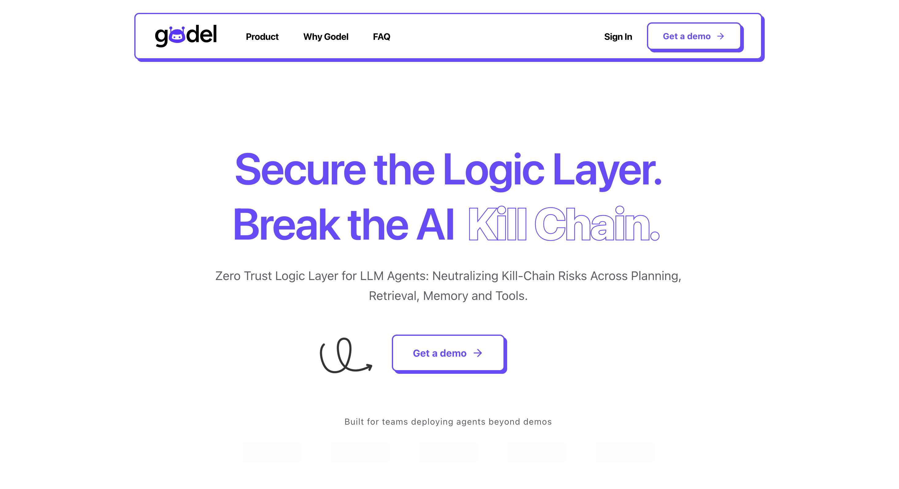

# Gödel Labs | Executive AI Integrity & Security



A high-performance, brutalist-inspired landing page for **Gödel**, the Zero-Trust Logic Layer for LLM Agents. This project showcases Gödel's ability to neutralize kill-chain risks across planning, retrieval, memory, and tools.

## 🚀 Key Features

- **Zero-Trust Logic Layer**: Security that sits outside the model and inside the system.
- **Multi-Stage Behavioral Analysis**: Detecting risk patterns that standard filters miss.
- **Zero-Day Input Inspection**: Continuous scanning of RAG corpora and tool outputs.
- **Enterprise-Ready**: Offline-first, no token burn, and model-agnostic.

## 🛠️ Tech Stack

- **Framework**: [Next.js 14+](https://nextjs.org/) (App Router)
- **Styling**: [Tailwind CSS](https://tailwindcss.com/)
- **Animations**: [Framer Motion](https://www.framer.com/motion/)
- **Icons**: [Lucide React](https://lucide.dev/)
- **Typography**: Space Grotesk / Inter
- **Security**: [Cloudflare Turnstile](https://developers.cloudflare.com/turnstile/) (CAPTCHA alternative)
- **Email**: [Resend](https://resend.com/) (Transactional email API)

## 📦 Getting Started

### Prerequisites

- Node.js 18+ installed
- Cloudflare Turnstile account (free at [Cloudflare Dashboard](https://dash.cloudflare.com/))
- Resend account (free at [Resend](https://resend.com/))

### Installation

First, install the dependencies:

```bash
npm install
```

### Environment Setup

1. Copy the example environment file:

```bash
cp .env.example .env.local
```

2. Get your Cloudflare Turnstile keys:
   - Go to [Cloudflare Dashboard](https://dash.cloudflare.com/)
   - Navigate to Turnstile
   - Create a new site
   - Copy the Site Key and Secret Key

3. Get your Resend API key:
   - Go to [Resend](https://resend.com/)
   - Sign up/Login
   - Navigate to API Keys
   - Create a new API key
   - Verify your domain (sales@godel-labs.ai)

4. Update `.env.local` with your keys:

```env
NEXT_PUBLIC_TURNSTILE_SITE_KEY=your_site_key_here
TURNSTILE_SECRET_KEY=your_secret_key_here
RESEND_API_KEY=your_resend_api_key_here
SALES_EMAIL=sales@godel-labs.ai
```

### Running the Development Server

Then, run the development server:

```bash
npm run dev
```

Open [http://localhost:3036](http://localhost:3036) (or your configured port) with your browser to see the result.

## � Production Deployment

### Building for Production

To create an optimized production build:

```bash
npm run build
```

This will:
- Compile TypeScript
- Optimize assets and images
- Generate static pages where possible
- Create a production-ready `.next` folder

### Running Production Build Locally

Test the production build locally before deploying:

```bash
npm run build
npm start
```

The app will run on [http://localhost:3000](http://localhost:3000) (default Next.js port).

### Deployment Options

#### 1. Vercel (Recommended)

The easiest way to deploy is using [Vercel](https://vercel.com/), the platform built by Next.js creators:

```bash
# Install Vercel CLI
npm i -g vercel

# Deploy
vercel
```

Or connect your GitHub repository:
1. Go to [vercel.com](https://vercel.com/)
2. Import your GitHub repository
3. Configure environment variables
4. Deploy

**Environment Variables** (add in Vercel Dashboard):
```
NEXT_PUBLIC_TURNSTILE_SITE_KEY=your_production_site_key
TURNSTILE_SECRET_KEY=your_production_secret_key
RESEND_API_KEY=your_resend_api_key
SALES_EMAIL=sales@godel-labs.ai
```

#### 2. Docker Deployment

Build and run with Docker:

```dockerfile
# Create Dockerfile
FROM node:18-alpine AS base

# Install dependencies only when needed
FROM base AS deps
RUN apk add --no-cache libc6-compat
WORKDIR /app

COPY package*.json ./
RUN npm ci

# Rebuild the source code only when needed
FROM base AS builder
WORKDIR /app
COPY --from=deps /app/node_modules ./node_modules
COPY . .

ENV NEXT_TELEMETRY_DISABLED 1

RUN npm run build

# Production image
FROM base AS runner
WORKDIR /app

ENV NODE_ENV production
ENV NEXT_TELEMETRY_DISABLED 1

RUN addgroup --system --gid 1001 nodejs
RUN adduser --system --uid 1001 nextjs

COPY --from=builder /app/public ./public
COPY --from=builder --chown=nextjs:nodejs /app/.next/standalone ./
COPY --from=builder --chown=nextjs:nodejs /app/.next/static ./.next/static

USER nextjs

EXPOSE 3000

ENV PORT 3000

CMD ["node", "server.js"]
```

Build and run:

```bash
docker build -t godel-landing .
docker run -p 3000:3000 --env-file .env.local godel-landing
```

#### 3. Traditional VPS/Server

For deployment on a VPS (DigitalOcean, AWS EC2, etc.):

```bash
# On your server
git clone <your-repo>
cd execve-landing-page
npm install
npm run build

# Use PM2 for process management
npm install -g pm2
pm2 start npm --name "godel-landing" -- start
pm2 save
pm2 startup
```

Setup Nginx reverse proxy:

```nginx
server {
    listen 80;
    server_name your-domain.com;

    location / {
        proxy_pass http://localhost:3000;
        proxy_http_version 1.1;
        proxy_set_header Upgrade $http_upgrade;
        proxy_set_header Connection 'upgrade';
        proxy_set_header Host $host;
        proxy_cache_bypass $http_upgrade;
    }
}
```

### Production Checklist

- [ ] Set all environment variables in production
- [ ] Update Turnstile site key for production domain
- [ ] Verify Resend domain and email sender
- [ ] Enable HTTPS/SSL certificate
- [ ] Configure custom domain DNS
- [ ] Test form submission and email delivery
- [ ] Check performance with Lighthouse
- [ ] Enable error monitoring (Sentry, etc.)
- [ ] Set up analytics (optional)
- [ ] Configure CSP headers for security

### Performance Tips

- **Image Optimization**: Next.js automatically optimizes images with `next/image`
- **Code Splitting**: Automatic with Next.js App Router
- **Caching**: Configure CDN caching headers
- **Bundle Analysis**: Run `npm run build` to see bundle sizes

## �🔐 Backend API

The project includes a Next.js API route for handling form submissions with Turnstile verification:

- **Endpoint**: `POST /api/submit-demo`
- **Location**: `src/app/api/submit-demo/route.ts`
- **Features**:
  - Server-side Turnstile token validation
  - Form data processing
  - Email notifications via Resend
  - Error handling and validation

### Email Notifications

When a demo form is submitted:
1. Form data is validated
2. Turnstile token is verified
3. Professional HTML email is sent to `sales@godel-labs.ai`
4. Email includes all form details and submission timestamp

The email template uses a brutalist design matching the landing page aesthetic.

### Turnstile Integration

The demo form (`/demo`) includes:

- **Client-side**: Turnstile widget rendering and token capture
- **Server-side**: Token verification via Cloudflare API
- **Security**: Prevents bot submissions and automated attacks

Learn more:
- [Turnstile Client-side Documentation](https://developers.cloudflare.com/turnstile/get-started/client-side-rendering/)
- [Turnstile Server-side Validation](https://developers.cloudflare.com/turnstile/get-started/server-side-validation/)

## 🎨 Design Philosophy

This landing page follows a **Brutalist UI** aesthetic:
- Bold, thick borders (2px+)
- High-contrast shadows (Neo-brutalism)
- Vibrant accent colors
- Sharp corners and raw layout structures

## 📄 License

Proprietary © [Execve AI](https://github.com/execve-ai)
